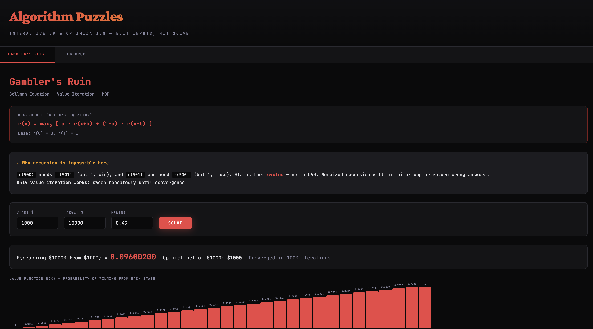

# Algorithm Puzzles

A playground for fun computer science algorithms, implemented in Rust.

Some of these come from my UC Berkeley days — shoutout to
[CS 170: Efficient Algorithms and Intractable Problems](https://cs170.org/),
taught from the classic textbook by Dasgupta, Papadimitriou, and Vazirani.
Some come from interviews and work over the years. All of them are problems
I find genuinely beautiful.

This repo is meant to be explored, forked, and played with. Each problem
has its own writeup with the math, the code, and an interactive visualization
you can run in your browser.

[](https://szabelin.github.io/algo-puzzles/)

**[▶ Try it interactively in your browser](https://szabelin.github.io/algo-puzzles/)**
— edit parameters, hit Solve, see the DP tables update live. Takes a few seconds to load.

---

## Problems

| # | Problem | Technique | Link |
|---|---------|-----------|------|
| 1 | **Gambler's Ruin** | Bellman Equation, Value Iteration, MDP | [README](problems/gamblers_ruin/README.md) · [Play](https://szabelin.github.io/algo-puzzles/#gambler) |
| 2 | **Egg Drop** | Minimax DP, Worst-Case Optimization | [README](problems/egg_drop/README.md) · [Play](https://szabelin.github.io/algo-puzzles/#eggdrop) |

More coming soon — knapsack, edit distance, LIS, matrix chain, and others.

---

## Did You Know?

Not every recurrence relation can be implemented as recursion.

If you've taken an algorithms course, you've probably internalized the idea
that a recurrence relation maps directly to a recursive function: write the
base cases, write the recursive case, add memoization, done. And for the
vast majority of DP problems — Fibonacci, knapsack, edit distance, egg drop,
LIS, matrix chain — that's exactly right. The dependency graph of subproblems
forms a **directed acyclic graph (DAG)**, so every recursive call moves
strictly toward a base case. No cycles, no problems.

But there's a class of problems where the dependency graph **has cycles**.
The Gambler's Ruin problem in this repo is one of them. When you write
`r(x) = p · r(x + b) + (1−p) · r(x − b)`, the state `r(x)` depends on
`r(x + b)` — a *larger* state — which can in turn depend back on `r(x)`.
You get circular dependencies: A needs B, B needs A. Pure recursion will
infinite-loop. Memoized recursion will hit the cycle, have no valid value
to return, and silently break the entire computation.

These problems require **value iteration** instead: initialize a guess for
all states, then sweep through and update each state using the current
estimates of its neighbors, repeating until the values converge. This is
the same technique used in reinforcement learning and optimal control
— it's how Berkeley's [CS 188 (Artificial Intelligence)](https://inst.eecs.berkeley.edu/~cs188/)
teaches Bellman equations and Markov Decision Processes.

How rare is this? In the standard CS algorithms curriculum — the problems
you'd see in CS 170 or a typical Leetcode grind — essentially **100% of
DP problems have DAG dependencies** and recursion works fine. Cyclic
dependencies show up when you cross into game theory, stochastic
optimization, and reinforcement learning. It's uncommon enough that most
engineers never encounter it, which is exactly what makes it a killer
interview question.

The Egg Drop problem, by contrast, is a perfect DAG — every call reduces
either the number of eggs or the number of floors. Recursion works
beautifully. Comparing the two side by side is the whole point of this repo.

---

## Running

```bash
# Build
cargo build --release

# Run problems
cargo run -- gambler 50 100 0.49
cargo run -- eggdrop 2 100

# Run tests (includes proof that recursion does not work for Gambler's Ruin)
cargo test
```

## Interactive Playground (GitHub Pages)

The `docs/` folder contains a self-contained HTML playground. To deploy:

1. Push this repo to GitHub
2. Go to **Settings → Pages**
3. Set source to **Deploy from a branch**, branch `main`, folder `/docs`
4. Your playground is live at `https://szabelin.github.io/algo-puzzles/`

---

## License

MIT
